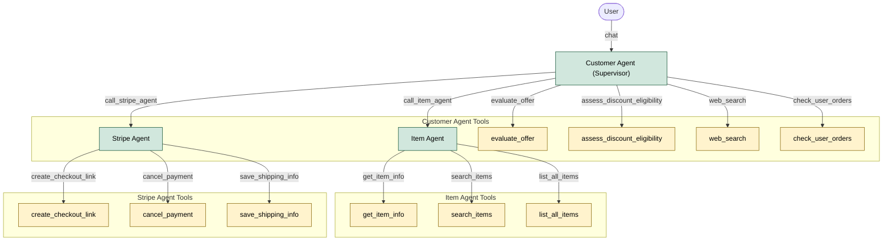

# Nego-lah

A second-hand marketplace where prices aren't fixed — buyers negotiate with an AI agent, or a human admin who can step into the chat, before checking out.

## Features

- Browse and search listings
- Real-time negotiation chat, streamed token-by-token
- LangGraph agent that looks up items, checks market prices, applies discount logic, and can generate a Stripe checkout link without leaving the conversation
- Stripe checkout with idempotent, race-safe order fulfillment (see [docs/adr/0001](docs/adr/0001-payment-concurrency-optimistic-claim.md))
- Admin console — items, orders, users, live chat takeover, audit log, 2FA login
- Dark/light theme

## Tech Stack

**Frontend** — Nuxt 4 (Vue 3), TypeScript, Tailwind CSS 4 + Nuxt UI 4, Bun, Supabase client

**Backend** — FastAPI, LangGraph + Gemini, Stripe, Redis, Supabase (Postgres, Auth, Storage)

## Architecture

The agent side is a supervisor (Customer Agent) delegating to two specialized sub-agents:



## Getting Started

### Prerequisites

- [Bun](https://bun.sh)
- Python 3.12
- Redis — the backend depends on it directly (admin sessions, rate limiting, caching) and won't start without it
- A Supabase project and the [Supabase CLI](https://supabase.com/docs/guides/cli)

### 1. Clone and set up the database

```bash
git clone https://github.com/terryong31/nego-lah.git
cd nego-lah

supabase login
supabase link --project-ref <your-project-ref>
supabase db push
```

See [supabase/README.md](supabase/README.md) for the RLS model and the admin-auth design.

### 2. Backend

```bash
cd backend
python3 -m venv .venv
source .venv/bin/activate
pip install -r requirements.txt
cp .env.example .env   # fill in Supabase, Gemini, Stripe, Redis values
uvicorn main:app --host 0.0.0.0 --port 8000 --reload
```

### 3. Frontend

```bash
cd frontend
bun install
```

Create `frontend/.env`:

```env
SUPABASE_URL=your_supabase_url
SUPABASE_KEY=your_supabase_anon_key
```

```bash
bun run dev
```

Frontend: `http://localhost:3000` · Backend: `http://localhost:8000`

### 4. Create an admin

```bash
# from backend/, with the venv active
python -m scripts.create_admin you@example.com 'your-password'
```

Log in at `/_console/login` — password, then a 6-digit code emailed to you.

---

Alternatively, `docker compose up --build` runs all four services (Caddy, frontend, backend, Redis) together — still needs `backend/.env` and `frontend/.env` populated first.

## License

All rights reserved — see [LICENSE](LICENSE). The source is here to read, not to reuse, modify, or redistribute.

---

[Terry Ong](https://github.com/terryong31) · © 2026
