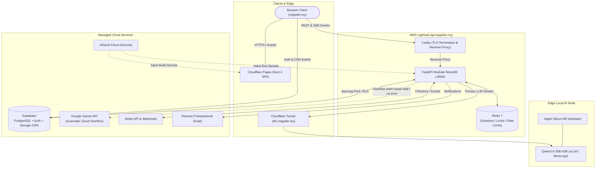
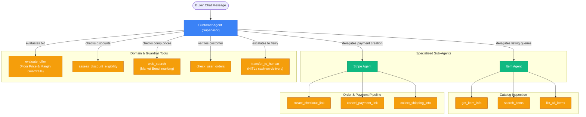
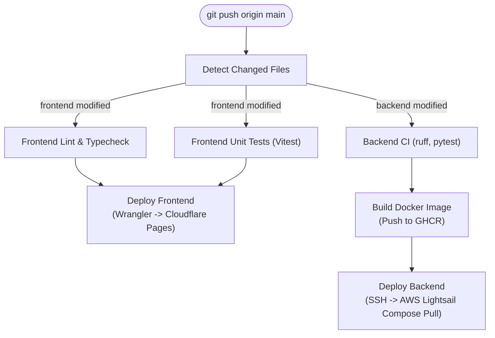

# Nego-Lah!

> **An autonomous second-hand marketplace with real-time AI price negotiations powered by a hybrid edge/cloud dual-LLM architecture.**

[](https://negolah.my)
[](https://api.negolah.my)
[](https://supabase.com)
[](https://infisical.com)
[](specs/)

---

## Features & Highlights

- **Real-Time Streaming Negotiation:** Token-by-token Server-Sent Events (SSE) chat with natural conversational pacing, typing indicators, and trilingual mastery (English, Manglish/Malay, Chinese).
- **Hybrid Dual-LLM Architecture:** Self-hosted `Qwen3.6-35B-A3B-4bit` running locally on Apple Silicon M5 hardware via Cloudflare Tunnel (`https://llm.negolah.my`), backed by sub-second automatic overflow to Google Gemini (`gemini-3.8-flash`) whenever the local lease is already held.
- **Private Floor Price Guardrails:** Sellers define hidden minimum floor prices and target margins. The agent defends margins, evaluates offers dynamically, and never leaks seller limits — the floor is withheld at both layers: it is absent from every public API response, and `anon`/`authenticated` hold only column-scoped `SELECT` on `items`, so the browser's Supabase key cannot read it either ([ADR-0009](docs/adr/0009-confidential-columns-enforced-in-postgres.md)).
- **Race-Safe Stripe Checkout:** Direct checkout link generation inside chat bubbles with optimistic inventory reservation, Redis atomic lock acquisition, and idempotent webhook reconciliation ([ADR-0001](docs/adr/0001-payment-concurrency-optimistic-claim.md)).
- **Human-in-the-Loop (HITL) Takeover:** Sellers monitor live negotiations and take over any chat, with visual handover indicators, real-time SSE updates, a searchable/sortable console inbox and a durable read watermark ([SPEC-019](specs/SPEC-019-realtime-chat-hitl-mobile-console-notifications.md), [SPEC-046](specs/SPEC-046-console-chat-operability.md), [SPEC-053](specs/SPEC-053-admin-conversation-read-state.md)). The agent hands off on request — and always for cash-on-delivery, which the platform deliberately does not handle in-app ([SPEC-055](specs/SPEC-055-cod-and-fcfs-policy.md)).
- **High-Performance Edge SPA:** Client-side Nuxt 4 Single Page Application (`ssr: false`) deployed to Cloudflare Pages edge network with Cloudflare Turnstile bot verification and PWA service worker caching ([ADR-0004](docs/adr/0004-nuxt-spa-cloudflare-pages-and-turnstile.md)).
- **Media & Asset CDN:** FastStart progressive HTTP 206 streaming for the product showcase video from a zero-egress Cloudflare R2 bucket, with high-DPI branding assets on the Supabase Storage CDN ([ADR-0010](docs/adr/0010-cloudflare-r2-media-cdn.md), [SPEC-028](specs/SPEC-028-storage-cdn-assets.md)).
- **Transactional Email System:** Purchase receipts, seller sale alerts, HITL escalations and batched unread-message digests, all rendered from one "Ledger" design-token system shared with the Supabase auth templates — borderless, hairline rules, dark-mode aware ([ADR-0013](docs/adr/0013-ledger-email-design-system.md)). Seller messages to an offline buyer are buffered for five minutes and delivered as a single email, rather than one per chat bubble ([ADR-0016](docs/adr/0016-buffered-notification-digests.md)).
- **Server-Side Image Pipeline:** Every upload is decoded rather than trusted — HEIC/HEIF from phones is converted, the long edge is capped, the file is recompressed, EXIF orientation is baked into the pixels, and all metadata (GPS included) is stripped ([ADR-0017](docs/adr/0017-server-side-image-normalization.md)).
- **Defence in Depth:** Magic-byte upload validation, a bot-defence middleware, strict CORS origin scoping, double-submit CSRF on the admin console, HSTS, an RFC 9116 `security.txt`, and PII masking in logs ([ADR-0014](docs/adr/0014-cloudflare-security-posture-hardening.md), [ADR-0015](docs/adr/0015-cors-origin-and-agent-tool-authorization-hardening.md)).
- **Zero-Trust Secrets Management:** Environment-segregated configurations (`dev`, `prod`) injected dynamically via Infisical Cloud ([ADR-0005](docs/adr/0005-infisical-secrets-management-and-api-domain.md)).

---

## System Architecture



---

## Negotiation Agent Graph (LangGraph)

The negotiation engine uses a state-machine supervisor architecture coordinating specialized tools:



---

## Monorepo Structure

```text
nego-lah/
├── frontend/             # Nuxt 4 SPA (Cloudflare Pages)
│   ├── app/              # Vue 3 components, pages, layouts, composables, stores
│   ├── i18n/             # Trilingual message catalogues (en, ms, zh)
│   ├── tests/            # Vitest unit & component suites (899 tests)
│   └── wrangler.toml     # Cloudflare Pages deployment configuration
├── backend/              # FastAPI Modular Monolith (AWS Lightsail)
│   ├── agent/            # LangGraph supervisor, sub-agents, tools, LLM factory
│   ├── domains/          # Domain boundaries (catalog, negotiation, billing, identity, webhooks)
│   ├── routes/           # HTTP surface, incl. the gated `admin/` console API
│   ├── core/             # Config, database pool, defence middleware, uploads, images
│   ├── services/         # Transactional email + buffered notification digests
│   ├── payment/          # Stripe checkout, webhooks, fulfilment, refunds
│   ├── templates/emails/ # Jinja "Ledger" email templates
│   ├── tests/            # Pytest suites with async fixtures (1,293 tests, 88% gate)
│   └── Dockerfile        # Production container image
├── specs/                # LeanSpec Spec-Driven Development documents (SPEC-001 … SPEC-055)
├── docs/adr/             # Architectural Decision Records (ADR-0001 … ADR-0017)
├── supabase/             # Postgres schemas, RLS policies, migrations, auth templates
├── .github/workflows/    # Path-filtered parallel GitHub Actions CI/CD pipeline
├── docker-compose.yml    # Production stack orchestration (API + Caddy + Redis)
├── Caddyfile             # TLS termination and security headers
├── mise.toml             # Universal environment and task orchestrator
└── README.md
```

---

## Developer Quickstart

The project uses [**mise**](https://mise.jdx.dev/) as the single toolchain and task
runner. It pins `uv`, `bun`, `infisical` and `lefthook`, and creates the backend's
Python 3.12 virtualenv at `backend/.venv` automatically.

### 1. Prerequisites

Ensure `mise` is installed:
```bash
# macOS / Linux
curl https://mise.run | sh
```

Install repository runtimes and dependencies:
```bash
git clone https://github.com/terryong31/nego-lah.git
cd nego-lah

mise install                 # pinned toolchain + backend venv
(cd frontend && bun install) # frontend dependencies
mise run hooks:install       # lefthook pre-commit hooks (once per clone)
```

`uv` resolves the backend's dependencies from `uv.lock` on first run, so
`mise run dev` works straight after this.

### 2. Environment Configuration (via Infisical)

All secrets are managed centrally through Infisical:
```bash
# Login to Infisical Cloud
infisical login

# Pull development secrets directly or run transparently
infisical run --env=dev -- mise run dev
```

*(For offline local development without Infisical: copy `backend/.env.example` to
`backend/.env`. The frontend reads `NUXT_PUBLIC_*` variables — see the
`runtimeConfig` block in `frontend/nuxt.config.ts` for the full list and its
defaults; every one of them falls back to a working development value.)*

### 3. Running Locally

Start the full stack with a single command (Redis + FastAPI backend on `:8000` + Nuxt frontend on `:3000`):

```bash
# Start all services concurrently
mise run dev

# Or start services individually
mise run dev:backend
mise run dev:frontend
```

### 4. Running Tests & Quality Checks

The project is driven test-first: a spec's acceptance criteria become failing tests
before the implementation exists. Backend coverage is gated at 88% and the gate
fails the build, so it cannot rot a point at a time.

```bash
# Run all test suites (Pytest + Vitest)
mise run test

# Individually
mise run test:backend      # pytest + coverage gate
mise run test:frontend     # vitest
mise run lint              # ruff + eslint
mise run typecheck         # vue-tsc

# Security audits (pip-audit, bandit, untrusted lifecycle scripts)
mise run audit
```

### 5. Operational Tasks

```bash
# Apply Supabase migrations
mise run db:migrate:staging
mise run db:migrate:prod

# Diagnose transactional email delivery (env, Resend domain status, recent sends)
mise run email:diagnose

# Sync email branding assets to the Supabase Storage CDN
mise run cdn:sync

# Verify Sentry telemetry across all seven pillars
mise run sentry:verify
```

---

## CI/CD & Deployment

Deployments are fully automated via GitHub Actions on push to `main`, featuring path-filtered change detection to build, test, and deploy only the services modified:



- **Path-Filtered Execution:** Non-code changes (documentation, specs, database schemas) bypass unnecessary compute. Modifications to frontend or backend run independently in parallel pipelines.
- **Frontend:** Built as a static SPA with environment secrets injected from Infisical and deployed to **Cloudflare Pages** at [`negolah.my`](https://negolah.my).
- **Backend:** Packaged into a multi-stage Docker image, pushed to GitHub Container Registry (`ghcr.io`), and deployed via zero-downtime SSH orchestration to **AWS Lightsail** at [`api.negolah.my`](https://api.negolah.my).

---

## Background Workers

Two in-process loops run in the FastAPI lifespan on every worker, so the single
Lightsail box needs no external scheduler:

| Worker | Cadence | Responsibility | Opt-out |
|--------|---------|----------------|---------|
| `_payment_cleanup_loop` | 30 min | Deactivate abandoned Stripe links and un-archive their listings once the 3-day TTL passes. Idempotent; one worker claims each cycle via a Redis slot lock. | `DISABLE_PAYMENT_CLEANUP=1` |
| `_unread_digest_loop` | 60 s | Flush buffered seller messages to a single email per buyer once the oldest has waited 5 minutes and the buyer still has not read the chat. Ownership comes from an atomic `LRANGE`+`DEL` drain rather than a lock. | `DISABLE_UNREAD_DIGEST=1` |

---

## Architectural Decisions & Specifications

Every significant decision is recorded as an ADR — the context, the options weighed,
the choice, and its consequences. The [full index](docs/adr/README.md) is the entry
point; the load-bearing ones are:

| ADR | Decision |
|-----|----------|
| [0001](docs/adr/0001-payment-concurrency-optimistic-claim.md) | Optimistic claim-at-payment over pessimistic inventory locking |
| [0002](docs/adr/0002-modular-monolith-over-grpc-microservices.md) | Modular monolith over distributed gRPC microservices |
| [0004](docs/adr/0004-nuxt-spa-cloudflare-pages-and-turnstile.md) | Nuxt SPA on Cloudflare Pages with universal Turnstile |
| [0007](docs/adr/0007-hybrid-edge-cloud-llm-load-balancer.md) | Hybrid edge/cloud LLM load balancer with atomic concurrency leases |
| [0009](docs/adr/0009-confidential-columns-enforced-in-postgres.md) | Seller-confidential columns enforced in Postgres, not just the API |
| [0011](docs/adr/0011-human-like-negotiation-concessions.md) | Human-like negotiation concessions (whole-RM steps, hold below floor) |
| [0013](docs/adr/0013-ledger-email-design-system.md) | One "Ledger" design system for all transactional and auth email |
| [0016](docs/adr/0016-buffered-notification-digests.md) | Buffered notification digests over per-message email |
| [0017](docs/adr/0017-server-side-image-normalization.md) | Server-side image normalization (HEIF ingest, auto-compression) |

Feature-level contracts live as [LeanSpec documents](specs/) — one file per change,
under 2,000 tokens, carrying the acceptance criteria and TDD scenarios the
implementation was actually driven from.

---

## License

All rights reserved — see [LICENSE](LICENSE).

---

[Terry Ong](https://github.com/terryong31) © 2026
