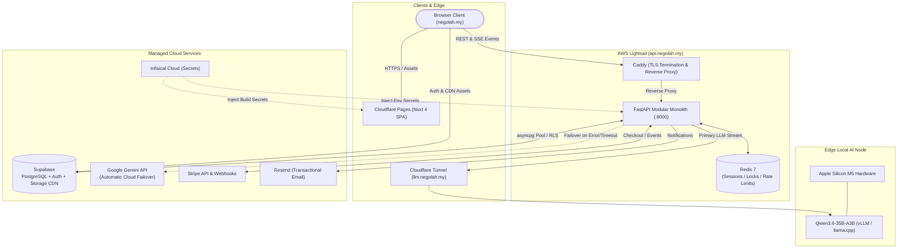
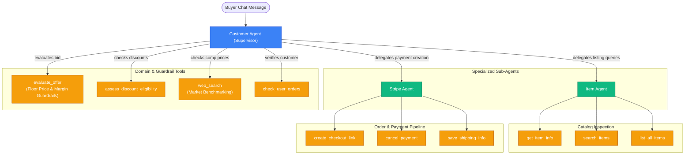

# Nego-Lah!

> **An autonomous second-hand marketplace with real-time AI price negotiations powered by a hybrid edge/cloud dual-LLM architecture.**

[](https://negolah.my)
[](https://api.negolah.my)
[](https://supabase.com)
[](https://infisical.com)
[](specs/)

---

## Features & Highlights

- **Real-Time Streaming Negotiation:** Token-by-token Server-Sent Events (SSE) chat with natural conversational pacing, typing indicators, and trilingual mastery (English, Manglish/Malay, Chinese).
- **Hybrid Dual-LLM Architecture:** Self-hosted `Qwen3.6-35B-A3B-4bit` running locally on Apple Silicon M5 hardware via Cloudflare Tunnel (`https://llm.negolah.my`), backed by sub-second automatic fallback to Google Gemini (`gemini-2.5-flash`).
- **Private Floor Price Guardrails:** Sellers define hidden minimum floor prices and target margins. The agent defends margins, evaluates offers dynamically, and never leaks seller limits — the floor is withheld at both layers: it is absent from every public API response, and `anon`/`authenticated` hold only column-scoped `SELECT` on `items`, so the browser's Supabase key cannot read it either ([ADR-0009](docs/adr/0009-confidential-columns-enforced-in-postgres.md)).
- **Race-Safe Stripe Checkout:** Direct checkout link generation inside chat bubbles with optimistic inventory reservation, Redis atomic lock acquisition, and idempotent webhook reconciliation ([ADR-0001](docs/adr/0001-payment-concurrency-optimistic-claim.md)).
- **Human-in-the-Loop (HITL) Takeover:** Sellers and administrators can monitor live negotiations and seamlessly take over chats with visual handover indicators and real-time SSE updates ([SPEC-019](specs/SPEC-019-realtime-chat-hitl-mobile-console-notifications.md)).
- **High-Performance Edge SPA:** Client-side Nuxt 4 Single Page Application (`ssr: false`) deployed to Cloudflare Pages edge network with Cloudflare Turnstile bot verification and PWA service worker caching ([ADR-0004](docs/adr/0004-nuxt-spa-cloudflare-pages-and-turnstile.md)).
- **Media & Asset CDN:** FastStart progressive HTTP 206 streaming for product showcase video demo and high-DPI assets hosted on Supabase Storage CDN ([SPEC-028](specs/SPEC-028-storage-cdn-assets.md)).
- **Zero-Trust Secrets Management:** Environment-segregated configurations (`dev`, `prod`) injected dynamically via Infisical Cloud ([ADR-0005](docs/adr/0005-infisical-secrets-management-and-api-domain.md)).

---

## System Architecture



---

## Negotiation Agent Graph (LangGraph)

The negotiation engine uses a state-machine supervisor architecture coordinating specialized tools:



---

## Monorepo Structure

```text
nego-lah/
├── frontend/             # Nuxt 4 SPA (Cloudflare Pages)
│   ├── app/              # Vue 3 components, pages, layouts, composables
│   ├── tests/            # Vitest unit & component test suites (760+ tests)
│   └── wrangler.toml     # Cloudflare Pages deployment configuration
├── backend/              # FastAPI Modular Monolith (AWS Lightsail)
│   ├── domains/          # Domain-driven architecture (catalog, negotiation, billing, etc.)
│   ├── tests/            # Pytest test suites with async fixtures
│   ├── Dockerfile        # Production container image
│   └── docker-compose.yml# Production stack orchestration
├── specs/                # LeanSpec Spec-Driven Development documents (SPEC-001 to SPEC-028)
├── docs/adr/             # Architectural Decision Records (ADR-0001 to ADR-0007)
├── supabase/             # Postgres schemas, RLS policies, migrations, and seeds
├── .github/workflows/    # Optimized parallel GitHub Actions CI/CD pipelines
├── mise.toml             # Universal environment and task orchestrator
└── README.md
```

---

## Developer Quickstart

The project uses [**mise**](https://mise.jdx.dev/) for deterministic toolchain management (`python 3.12`, `bun`, `uv`, `infisical`).

### 1. Prerequisites

Ensure `mise` is installed:
```bash
# macOS / Linux
curl https://mise.run | sh
```

Install repository dependencies and runtimes:
```bash
git clone https://github.com/terryong31/nego-lah.git
cd nego-lah
mise install
```

### 2. Environment Configuration (via Infisical)

All secrets are managed centrally through Infisical:
```bash
# Login to Infisical Cloud
infisical login

# Pull development secrets directly or run transparently
infisical run --env=dev -- mise run dev
```

*(Alternatively, copy `.env.example` to `.env` in `frontend/` and `backend/` for offline local development).*

### 3. Running Locally

Start the full stack with a single command (Redis + FastAPI backend on `:8000` + Nuxt frontend on `:3000`):

```bash
# Start all services concurrently
mise run dev

# Or start services individually
mise run dev:backend
mise run dev:frontend
```

### 4. Running Tests & Quality Checks

```bash
# Run all test suites (Pytest + Vitest)
mise run test

# Run frontend tests & linting
mise run test:frontend
mise run lint
mise run typecheck

# Run backend tests
mise run test:backend
```

---

## CI/CD & Deployment

Deployments are fully automated via GitHub Actions on push to `main`, featuring path-filtered change detection to build, test, and deploy only the services modified:


- **Path-Filtered Execution:** Non-code changes (documentation, specs, database schemas) bypass unnecessary compute. Modifications to frontend or backend run independently in parallel pipelines.
- **Frontend:** Built as a static SPA with environment secrets injected from Infisical and deployed to **Cloudflare Pages** at [`negolah.my`](https://negolah.my).
- **Backend:** Packaged into a multi-stage Docker image, pushed to GitHub Container Registry (`ghcr.io`), and deployed via zero-downtime SSH orchestration to **AWS Lightsail** at [`api.negolah.my`](https://api.negolah.my).

---

## Architectural Decisions & Specifications

For deep dives into design rationale and protocol contracts, refer to:

- [ADR-0001: Payment Concurrency & Optimistic Claim](docs/adr/0001-payment-concurrency-optimistic-claim.md)
- [ADR-0002: Modular Monolith Domain Boundaries](docs/adr/0002-modular-monolith-over-grpc-microservices.md)
- [ADR-0003: Dual-Provider Multimodal LLM Failover](docs/adr/0003-dual-provider-multimodal-llm-failover.md)
- [ADR-0004: Nuxt SPA on Cloudflare Pages & Turnstile](docs/adr/0004-nuxt-spa-cloudflare-pages-and-turnstile.md)
- [ADR-0005: Infisical Secrets Management & API Routing](docs/adr/0005-infisical-secrets-management-and-api-domain.md)
- [ADR-0007: Hybrid Edge/Cloud LLM Load Balancer](docs/adr/0007-hybrid-edge-cloud-llm-load-balancer.md)
- [LeanSpec Specifications Index](specs/)

---

## License

All rights reserved — see [LICENSE](LICENSE).

---

[Terry Ong](https://github.com/terryong31) © 2026
