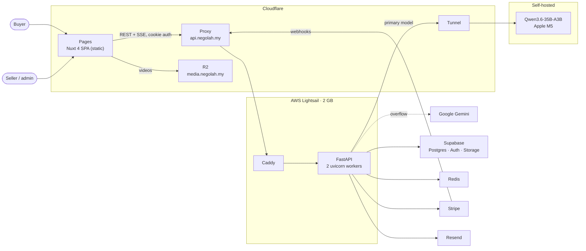

# Architecture

How Nego-Lah is put together today. This is a **living document**: when the system changes,
this page changes with it. The reasoning behind each choice lives in the [ADRs](../adr/README.md);
the original blueprint, [SPEC-000](../specs/SPEC-000-system-architecture.md), is kept as a record
and no longer matches the code.

- [Agent architecture](agent.md) — how a negotiation turn runs.
- [Data model](../data/README.md) — tables, ownership, confidentiality.
- [Core flows](../flows/README.md) — sequence diagrams for bargaining, payment and hand-over.

## System context



| Component | Role |
|-----------|------|
| **Nuxt SPA** on Cloudflare Pages | Pure client-side app (`ssr: false`). Holds no tokens and no Supabase SDK; every call goes to the API with `credentials: 'include'` ([ADR-0004](../adr/0004-nuxt-spa-cloudflare-pages-and-turnstile.md), [ADR-0028](../adr/0028-buyer-sessions-move-behind-the-api.md)). |
| **FastAPI** on Lightsail | The only backend: REST, SSE, webhooks, the agent, and two in-process [background loops](../workers/README.md). The origin accepts traffic only through the Cloudflare proxy ([ADR-0025](../adr/0025-edge-proxy-pre-auth-rate-limiting-local-jwt.md)), and only from this site's zone: Caddy checks a secret header the zone adds ([ADR-0032](../adr/0032-origin-authenticated-by-zone-secret-header.md)). |
| **Supabase** | Postgres (reached through PostgREST with the service role), Auth (brokered by the API, never called from the browser), and Storage for item images and avatars. |
| **Redis** | Managed Upstash (`rediss://`) in production, set by the `REDIS_URL` secret; there is no Redis container on the box. Buyer and admin sessions, rate limits, the LLM lease, pending payment links, unread-digest queues, and the pub/sub channel that fans notifications out across workers. |
| **LLMs** | Self-hosted Qwen first, Gemini on overflow — see [agent architecture](agent.md). |
| **Stripe** | Checkout Sessions and Payment Links; fulfilment is driven by signed webhooks ([ADR-0001](../adr/0001-payment-concurrency-optimistic-claim.md)). |
| **Resend** | Transactional email (receipts, digests, OTP). Local development sends to Mailpit instead. |
| **Infisical** | Injects secrets at runtime (`infisical run`) and into CI builds ([ADR-0005](../adr/0005-infisical-secrets-management-and-api-domain.md)). |

## Backend structure

The backend is a modular monolith ([ADR-0002](../adr/0002-modular-monolith-over-grpc-microservices.md),
[ADR-0027](../adr/0027-code-relocation-into-domain-packages.md)) with three layers. A file's layer is
its directory:

```text
core/      infrastructure: config, Redis, Supabase connector, CSRF, logging, email, bus.
           Imports nothing from domains/ or console/.
domains/   bounded contexts; all business logic.
console/   composition root for admin screens that need two domains at once.
```

The domains are ranked, and a domain may import only domains **below** it
([ADR-0030](../adr/0030-the-domain-graph-is-acyclic.md)):

```text
identity (0)  <  catalog (1)  <  billing (2)  <  negotiation (3)
```

| Domain | Owns tables | Responsibility |
|--------|-------------|----------------|
| `identity` | `user_profiles`, `admin_audit_log` | Buyer and admin sessions, profiles, avatars, account deletion. |
| `catalog` | `items` | Listings, images, the atomic `available → sold` claim. |
| `billing` | `orders`, `transactions` | Checkout, Stripe webhooks, fulfilment, refunds, shipping. |
| `negotiation` | `messages`, `chat_settings`, `conversations` (archived) | The agent, chat history, SSE, human hand-over, unread digests. |

`domains/webhooks` holds the signature-verified Resend inbound webhook.

When a lower domain needs something from a higher one, it goes through `core/bus.py`, never an
import: `bus.emit` for fan-out events (`purchase.fulfilled`, `shipment.recorded`, `user.deleted`)
and `bus.ask` for a single fact (`billing.active_negotiated_price`, `negotiation.ai_settings_map`).
All of this is enforced by `backend/tests/test_domain_boundaries.py`, which AST-scans every import
and every `.table(…)` call.

## Constraints that shape everything

- **2 GB of RAM.** No Celery, no queue, no second service. Slow work runs in lifespan loops or
  detached `asyncio` tasks ([ADR-0021](../adr/0021-agent-turns-outlive-their-http-response.md)).
  Domain packages load lazily so LangChain is not imported at boot.
- **The floor price never leaves the server.** `items.min_price` is withheld by Postgres column
  grants, not just by the API ([ADR-0009](../adr/0009-confidential-columns-enforced-in-postgres.md)),
  and is never placed in a prompt.
- **One backend container.** Deploys are health-gated with automatic rollback but are not
  zero-downtime; see [CI/CD](../ci-cd/README.md).
