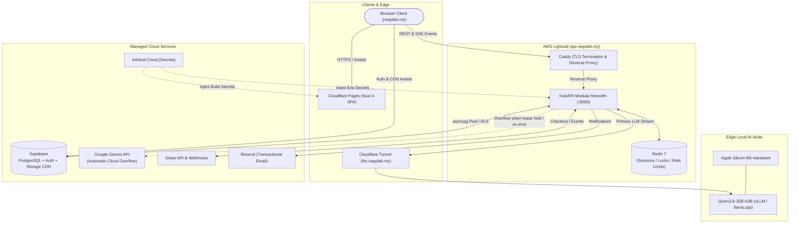

# Context & Objectives

Nego-Lah is an autonomous second-hand marketplace designed to automate price negotiations between buyers and sellers. It removes lowballer fatigue and manual messaging by employing an autonomous AI bargaining agent.

To support high-throughput, low-latency, and cost-effective AI interactions while remaining resilient, the platform operates on a **hybrid edge/cloud dual-LLM architecture** and a **modular monolith** backend hosted within a 2 GB VPS envelope.

---

# Acceptance Criteria & Architectural Invariants

- [x] **Zero Cloud LLM Dependency for Baseline Traffic:** Primary chat inferences route to a self-hosted `Qwen3.6-35B-A3B-4bit` on local Apple Silicon M5 hardware via Cloudflare Tunnel.
- [x] **Sub-Second Cloud Overflow:** If the local model lease is held or health check fails (1.5s timeout), traffic overflows to Google Gemini (`gemini-3.8-flash`) dynamically.
- [x] **Strict Private Floor Protection:** Seller's `min_price` is guarded at both the database level (Postgres column-level privileges) and agent tool level (`evaluate_offer`). Floor is never leaked in reasoning or API.
- [x] **Optimistic Claim-at-Payment (ADR-0001):** Items remain available during checkout; atomic conditional UPDATE at fulfillment claims the item or automatically refunds concurrent losers.
- [x] **Modular Monolith Boundaries:** Backend business logic is strictly partitioned into `domains/` (`catalog`, `negotiation`, `billing`, `identity`, `webhooks`). No cross-domain direct database queries.

---

# Technical Design & Architecture Contracts

## 1. End-to-End System Architecture



## 2. Negotiation Agent Graph (LangGraph)

The negotiation engine operates as a unified ReAct agent coordinating domain tools directly (ADR 0026 / SPEC-079), eliminating sub-agent indirection and multi-hop latency:

```mermaid
graph TD
    User([Buyer Chat Message]) --> Agent["Customer Agent (Unified ReAct Agent)"]

    subgraph DirectTools["Direct Domain Tools"]
        subgraph CatalogTools["Catalog Inspection"]
            GetItem["get_item_info"]
            SearchItems["search_items"]
            ListItems["list_all_items"]
        end

        subgraph NegoTools["Negotiation & Guardrails"]
            EvalOffer["evaluate_offer\n(Floor Price & Step Rounding)"]
            Discount["assess_discount_eligibility"]
            WebSearch["web_search\n(Market Benchmarking)"]
            Handoff["transfer_to_human\n(HITL / Cash-on-Delivery)"]
        end

        subgraph StripeTools["Order & Payment Pipeline"]
            CreateLink["create_checkout_link"]
            CancelPayment["cancel_payment_link"]
            Shipping["collect_shipping_info"]
            Orders["check_user_orders"]
        end
    end

    Agent -->|direct tool call| GetItem
    Agent -->|direct tool call| SearchItems
    Agent -->|direct tool call| ListItems
    Agent -->|direct tool call| EvalOffer
    Agent -->|direct tool call| Discount
    Agent -->|direct tool call| WebSearch
    Agent -->|direct tool call| Handoff
    Agent -->|direct tool call| CreateLink
    Agent -->|direct tool call| CancelPayment
    Agent -->|direct tool call| Shipping
    Agent -->|direct tool call| Orders

    classDef agent fill:#10b981,stroke:#047857,color:#fff
    classDef tool fill:#f59e0b,stroke:#b45309,color:#fff

    class Agent agent
    class GetItem,SearchItems,ListItems,EvalOffer,Discount,WebSearch,Handoff,CreateLink,CancelPayment,Shipping,Orders tool
```



---

# Dynamic Failover & Concurrency Logic

```
Incoming Request -> Acquire Redis Lease (token-owned, 10s TTL)
  ├── Lease acquired successfully
  │     └── Probe Local Qwen Health (1.5s timeout)
  │           ├── Healthy: Stream Qwen via Cloudflare Tunnel
  │           └── Unhealthy/Timeout: Release Lease -> Fallback to Gemini 3.8 Flash
  └── Lease busy (already held by concurrent turn)
        └── Immediate Overflow to Gemini 3.8 Flash
```

---

# Test-Driven Development (TDD) Scenarios

- [x] **Scenario 1:** `test_dynamic_llm_factory.py` verifies local Qwen is used when healthy and fallback to Gemini occurs on connection timeout.
- [x] **Scenario 2:** `test_agent_floor_confidentiality.py` asserts that `min_price` is never exposed in reasoning or outputs.
- [x] **Scenario 3:** `test_routes_payment.py` verifies that simultaneous checkout creation attempts fail gracefully with optimistic lock rejection.

---

# Implementation Files

- `backend/domains/negotiation/llm_factory.py` - Dynamic LLM routing and concurrency lease management
- `backend/agent/bot.py` - LangGraph supervisor and negotiation state graph
- `backend/agent/tools/negotiation.py` - Guardrail tools (`evaluate_offer`)
- `backend/domains/billing/service.py` - Stripe payment links and atomic locks
- `frontend/app/pages/chat.vue` - Token-by-token SSE streaming negotiation UI
