# Agent Architecture: Unified ReAct Negotiation Engine

This document details the conversational AI agent architecture powering **Nego-Lah**, following the unified single-agent pattern established in [ADR-0026](../../adr/0026-unified-single-agent-architecture.md) and [SPEC-079](../../specs/SPEC-079-unified-single-agent-architecture.md).

---

## 1. Unified Agent Topology

Rather than delegating tasks across nested sub-agents (which introduced cascading latency and token overhead), the negotiation engine uses a single, unified `Customer Agent` built with LangGraph ReAct that binds all domain tools directly:

```mermaid
graph TD
    User([Buyer Chat Message]) --> Agent["Customer Agent (Unified ReAct Agent)"]

    subgraph DirectTools["Direct Domain Tools"]
        subgraph CatalogTools["Catalog Inspection"]
            GetItem["get_item_info"]
            SearchItems["search_items"]
            ListItems["list_all_items"]
        end

        subgraph NegoTools["Negotiation & Guardrails"]
            EvalOffer["evaluate_offer\n(Floor Price & Step Rounding)"]
            Discount["assess_discount_eligibility"]
            WebSearch["web_search\n(Market Benchmarking)"]
            Handoff["transfer_to_human\n(HITL / Cash-on-Delivery)"]
        end

        subgraph StripeTools["Order & Payment Pipeline"]
            CreateLink["create_checkout_link"]
            CancelPayment["cancel_payment_link"]
            Shipping["collect_shipping_info"]
            Orders["check_user_orders"]
        end
    end

    Agent -->|direct tool call| GetItem
    Agent -->|direct tool call| SearchItems
    Agent -->|direct tool call| ListItems
    Agent -->|direct tool call| EvalOffer
    Agent -->|direct tool call| Discount
    Agent -->|direct tool call| WebSearch
    Agent -->|direct tool call| Handoff
    Agent -->|direct tool call| CreateLink
    Agent -->|direct tool call| CancelPayment
    Agent -->|direct tool call| Shipping
    Agent -->|direct tool call| Orders

    classDef agent fill:#10b981,stroke:#047857,color:#fff
    classDef tool fill:#f59e0b,stroke:#b45309,color:#fff

    class Agent agent
    class GetItem,SearchItems,ListItems,EvalOffer,Discount,WebSearch,Handoff,CreateLink,CancelPayment,Shipping,Orders tool
```

---

## 2. Direct Tool Ecosystem

The agent operates with 11 specialized direct tools organized by domain responsibility:

| Domain | Tools | Description |
| :--- | :--- | :--- |
| **Catalog** | `get_item_info`, `search_items`, `list_all_items` | Database inventory search and structured item detail inspection. |
| **Negotiation & Margin** | `evaluate_offer` | Enforces secret floor price (`min_price`) and natural RM5 step rounding (`_round_to_step`). |
| **Discounting** | `assess_discount_eligibility` | Evaluates buyer concession arguments (student, bundled shipping, etc.). |
| **External Context** | `web_search` | External search lookup for market benchmark context when needed. |
| **Orders & Fulfillment** | `create_checkout_link`, `cancel_payment_link`, `collect_shipping_info`, `check_user_orders` | Stripe checkout link creation, atomic reservation, and shipping detail capture. |
| **Escalation** | `transfer_to_human` | Disables automated AI and alerts human operator for cash-on-delivery (COD), meet-ups, or disputes. |

---

## 3. Request-Scoped Context & Concurrency

Execution state is isolated per request using Python `ContextVar` primitives:
- `current_user_id`: Identifies the authenticated buyer session.
- `current_item_id`: Maintains the focus item UUID without brittle inter-agent prompt passing.
- `pending_handoff`: Captures transition separators delivered after final agent generation.

The agent interacts with the **Hybrid Edge-Cloud LLM Load Balancer**:
- **Primary:** Local `Qwen3.6-35B-A3B` on Apple Silicon hardware over Cloudflare Tunnel via a Redis lease (10s TTL, single-concurrency).
- **Overflow / Fallback:** Google Gemini (`gemini-3.8-flash`) triggers when the lease is held or health checks exceed 1.5s.

---

## 4. Prompt Caching Strategy

By keeping the system persona and tool definitions static and unified across all invocations:
- Modern LLM context caches (Gemini Context Caching) achieve **50%–80% input token cost reduction**.
- Time-to-First-Token (TTFT) drops to sub-second speeds.
