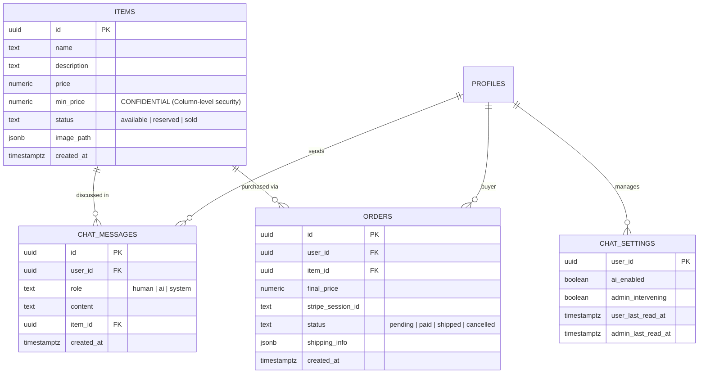

# Database & Storage Architecture: Data Isolation & Defense

This document details the PostgreSQL schema design, access control policies, connection pooling, and asset storage architecture for **Nego-Lah**.

---

## 1. Core Data Models

The marketplace is modeled across five core domain tables in Supabase PostgreSQL:

---

## 2. Floor Price Defense: Column-Level Privilege Isolation

The secret floor price (`min_price`) represents the seller's minimum acceptable margin. It must **never** leak through network responses or client-side queries:
1. **Database Column Privileges:** `min_price` is explicitly revoked from the `anon` and `authenticated` PostgreSQL roles.
2. **Service Role Bypass:** Only the backend service client (`admin_supabase` / `asyncpg` service connection) can read `min_price` during execution of the `evaluate_offer` tool.
3. **No Prompt Leakage:** `min_price` is never included in the agent system prompt or user message payload.

---

## 3. Concurrency & Optimistic Inventory Claims

To prevent double-selling across concurrent buyer chats:
- Payment sessions utilize **atomic claim-at-payment**.
- When a Stripe checkout webhook fires (`checkout.session.completed`), the item state transitions atomically from `available` to `sold`.
- In the event of a simultaneous checkout race condition, the second transaction is rejected and automatically refunded via Stripe webhooks.

---

## 4. Media & Asset Storage CDN

Item imagery and user attachments are processed and stored across a resilient two-tier CDN architecture:
- Primary uploads undergo server-side normalization and WebP compression.
- Images are served via Cloudflare R2 and Supabase Storage CDN edge points to minimize origin load.

---

## 5. Key Architectural Decisions
- [ADR-0001: Payment Concurrency Optimistic Claim](../../adr/0001-payment-concurrency-optimistic-claim.md)
- [ADR-0009: Confidential Columns Enforced in Postgres](../../adr/0009-confidential-columns-enforced-in-postgres.md)
- [ADR-0010: Cloudflare R2 Media CDN](../../adr/0010-cloudflare-r2-media-cdn.md)
