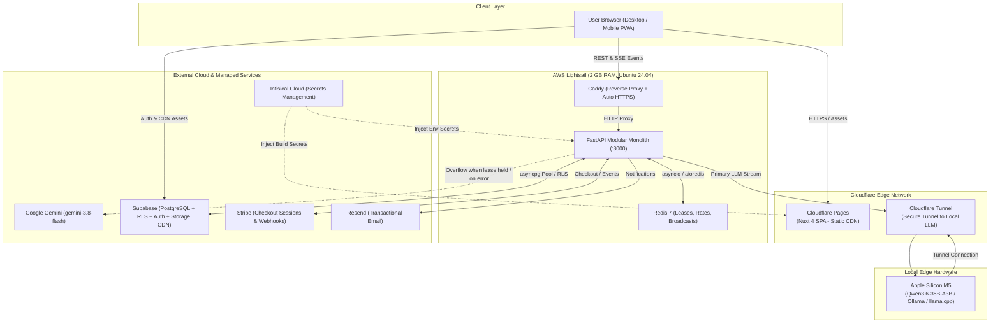

# System Architecture: End-to-End Topology & Infrastructure

This document details the complete end-to-end system topology, edge routing, and server infrastructure for **Nego-Lah**.

---

## 1. High-Level System Topology



---

## 2. Infrastructure Constraints & Lifespan Workers

The backend operates on a single **AWS Lightsail instance with 2 GB RAM**. Heavy task runners like Celery or external worker fleets are prohibited:
- Background tasks (message digests, lease hygiene, payment sweeps) run as **in-process `asyncio` lifespan worker loops**.
- Memory usage is kept lean by caching compiled graphs and utilizing connection-pooled clients (`asyncpg`).

---

## 3. Dynamic Failover & Concurrency Logic

```
Incoming Request -> Acquire Redis Lease (token-owned, 10s TTL)
  ├── Lease acquired successfully
  │     └── Probe Local Qwen Health (1.5s timeout)
  │           ├── Healthy: Stream Qwen via Cloudflare Tunnel
  │           └── Unhealthy/Timeout: Release Lease -> Fallback to Gemini 3.8 Flash
  └── Lease busy (already held by concurrent turn)
        └── Immediate Overflow to Gemini 3.8 Flash
```

---

## 4. Key Architectural Decisions
- [ADR-0002: Modular Monolith Architecture](../../adr/0002-modular-monolith-over-grpc-microservices.md)
- [ADR-0004: Nuxt SPA on Cloudflare Pages](../../adr/0004-nuxt-spa-cloudflare-pages-and-turnstile.md)
- [ADR-0005: Infisical Secrets Management](../../adr/0005-infisical-secrets-management-and-api-domain.md)
- [ADR-0007: Hybrid Edge-Cloud LLM Load Balancer](../../adr/0007-hybrid-edge-cloud-llm-load-balancer.md)
