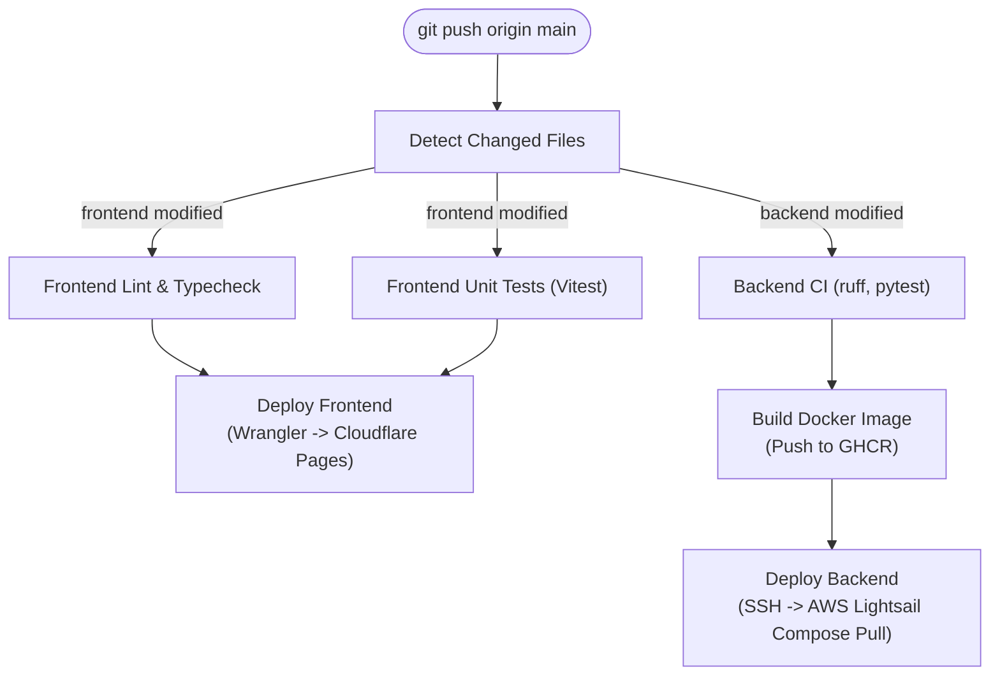

# CI/CD Pipeline & Deployment

Nego-Lah uses GitHub Actions for automated continuous integration and continuous deployment on push to `main`.

---

## 1. Pipeline Architecture

---

## 2. Path-Filtered Change Detection

To optimize build speed and compute usage, `.github/workflows/deploy.yml` utilizes path filtering:
- Changes affecting only documentation (`docs/**`), specifications (`docs/specs/**`), database migrations (`supabase/**`), or configuration files bypass application compute.
- Frontend and backend pipelines run concurrently and independently:
  - Modifying `frontend/**` triggers frontend linting, typechecking, Vitest testing, and Cloudflare Pages deployment.
  - Modifying `backend/**` triggers Ruff linting, Pytest test suites (enforcing the 88% coverage gate), Docker image building, and Lightsail deployment.

---

## 3. Frontend Deployment (Cloudflare Pages)

- **Target:** [`https://negolah.my`](https://negolah.my)
- **Engine:** Nuxt 4 Single Page Application (`ssr: false`).
- **Orchestration:** Built via `bun run generate`, deployed via `@cloudflare/wrangler-action` to Cloudflare Pages edge network.
- **Environment Ingestion:** Injected from Infisical Cloud during CI build step (`NUXT_PUBLIC_API_BASE_URL`, `NUXT_PUBLIC_SUPABASE_URL`, `NUXT_PUBLIC_SUPABASE_KEY`, `NUXT_PUBLIC_TURNSTILE_SITE_KEY`).

---

## 4. Backend Deployment (AWS Lightsail)

- **Target:** [`https://api.negolah.my`](https://api.negolah.my)
- **Environment:** Ubuntu Linux VPS on AWS Lightsail (2 GB RAM envelope).
- **Container Registry:** Multi-stage production container image built and pushed to GitHub Container Registry (`ghcr.io/terryong31/nego-lah-backend:latest`).
- **Orchestration:**
  1. GitHub Actions connects to the Lightsail instance over secure SSH with key authentication.
  2. Pulls updated container image from GHCR.
  3. Executes zero-downtime rolling restart via `docker compose up -d --remove-orphans`.
  4. Caddy automatically provisions and renews TLS certificates and proxies traffic to FastAPI on `:8000`.

---

## 5. Quality & Security Gates

Every deployment must pass the following automated gates:
1. **Backend Test Suite & Coverage Gate:**
   - 1,293+ Pytest tests executed.
   - Code coverage strictly enforced at **≥88%** (`FAIL Required test coverage of 88.0% not reached`).
2. **Frontend Quality:**
   - Vitest component and unit test suite.
   - Vue-TSC type checking (`bun run typecheck`).
   - ESLint validation (`bun run lint`).
3. **Security Audits:**
   - `pip-audit` for known dependency vulnerabilities.
   - `bandit` for static Python security issues.
