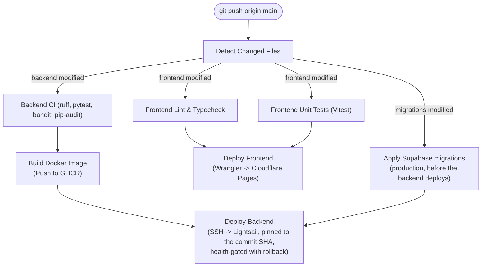

# CI/CD Pipeline & Deployment

Nego-Lah uses GitHub Actions for automated continuous integration and continuous deployment on push to `main`.

---

## 1. Pipeline Architecture

---

## 2. Path-Filtered Change Detection

To optimize build speed and compute usage, `.github/workflows/deploy.yml` utilizes path filtering:
- Changes affecting only documentation (`docs/**`) or specifications bypass application compute.
- Changes under `supabase/migrations/**` are validated on every PR and **applied to production by CI** on merge to `main`, before the backend that depends on them deploys (SPEC-096).
- Frontend and backend pipelines run concurrently and independently:
  - Modifying `frontend/**` triggers frontend linting, typechecking, Vitest testing, and Cloudflare Pages deployment.
  - Modifying `backend/**` triggers Ruff linting, Pytest test suites (enforcing the 88% coverage gate), Docker image building, and Lightsail deployment.

---

## 3. Frontend Deployment (Cloudflare Pages)

- **Target:** [`https://negolah.my`](https://negolah.my)
- **Engine:** Nuxt 4 Single Page Application (`ssr: false`).
- **Orchestration:** Built via `bun run generate`, deployed via `@cloudflare/wrangler-action` to Cloudflare Pages edge network.
- **Environment Ingestion:** Injected from Infisical Cloud during CI build step (`NUXT_PUBLIC_API_BASE_URL`, `NUXT_PUBLIC_TURNSTILE_SITE_KEY`, Sentry build variables). The browser holds no Supabase credentials (SPEC-093).

---

## 4. Backend Deployment (AWS Lightsail)

- **Target:** [`https://api.negolah.my`](https://api.negolah.my)
- **Environment:** Ubuntu Linux VPS on AWS Lightsail (2 GB RAM envelope).
- **Container Registry:** Multi-stage production container image built and pushed to GitHub Container Registry, tagged with the commit SHA (and `:latest`).
- **Orchestration:**
  1. GitHub Actions connects to the Lightsail instance over secure SSH with key authentication.
  2. Pulls the image for **this commit's SHA** (`BACKEND_IMAGE_TAG`) and recreates the backend container.
  3. Reloads Caddy gracefully (`caddy reload`), so open connections and SSE streams are not dropped by a proxy restart.
  4. Waits up to ~3 minutes for the container's healthcheck. If it never reports healthy, the job re-pins the previously running image and fails red.
  5. Caddy provisions and renews TLS certificates and proxies traffic to FastAPI on `:8000`.
- **Not zero-downtime.** There is one backend container, so recreating it drops traffic for the restart window (shutdown waits up to 20 s for in-flight agent turns; `stop_grace_period` is 30 s). True zero-downtime needs two replicas behind Caddy, rolled one at a time.
- **Rollback by hand:** `sudo env BACKEND_IMAGE_TAG=<previous sha> docker compose up -d backend` on the box.
- **Probes:** `/health` is liveness (the process is up); `/ready` checks Redis and reports whether cross-worker notifications are flowing.
- **Uptime:** `.github/workflows/uptime.yml` curls `https://negolah.my/` and `https://api.negolah.my/ready` every 10 minutes; a failed run emails whoever last edited that schedule.
- **Revoking every session:** `.github/workflows/ops-revoke-sessions.yml` (manual, `confirm: revoke`, gated by the `production` environment) runs `backend/scripts/revoke_all_sessions.py` against production Redis.

---

## 5. Quality & Security Gates

Every deployment must pass the following automated gates:
1. **Backend Test Suite & Coverage Gate:**
   - ~1,950 Pytest tests executed.
   - Code coverage strictly enforced at **≥88%** (`FAIL Required test coverage of 88.0% not reached`).
2. **Frontend Quality:**
   - Vitest component and unit test suite.
   - Vue-TSC type checking (`bun run typecheck`).
   - ESLint validation (`bun run lint`).
3. **Security Audits:**
   - `pip-audit` for known backend dependency vulnerabilities.
   - `bandit` for static Python security issues (production code; `tests/`, `scripts/`, `evals/` excluded).
   - `frontend/scripts/audit.sh` — `bun audit --audit-level=high`, with each unfixable, non-shipping advisory listed and justified in the script.
4. **Workflow hardening:** the default `GITHUB_TOKEN` is read-only, and third-party actions are pinned to commit SHAs.
