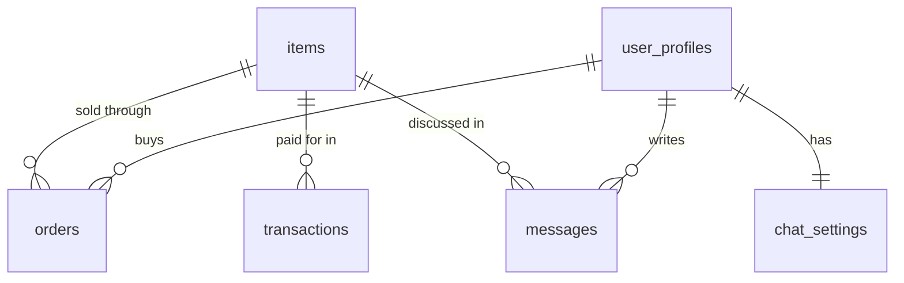

# Data Model

Postgres on Supabase holds everything durable; Redis holds everything that may expire. Living
document. The schema's source of truth is [`supabase/migrations/`](../../supabase/migrations/) —
read the SQL when this page and the database disagree, then fix this page.

## Principles

1. **The browser never queries Postgres.** Every table has RLS on. `items` is the only table with
   a public read policy (rows where `deleted_at is null`); everything else has none, so only the
   backend's service role reaches it. The SPA has no Supabase key at all
   ([ADR-0028](../adr/0028-buyer-sessions-move-behind-the-api.md)).
2. **Confidential columns are enforced by Postgres.** The table-wide `SELECT` on `items` is revoked
   from `anon` and `authenticated` and re-granted column by column, without `min_price` and
   `buyer_id` ([ADR-0009](../adr/0009-confidential-columns-enforced-in-postgres.md)). A request
   that bypasses the API still cannot read the floor price.
3. **Each table has one owning domain** and only that domain's code may touch it
   (`backend/tests/test_domain_boundaries.py`, [ADR-0030](../adr/0030-the-domain-graph-is-acyclic.md)).
4. **Chat history is append-only.** One row per message, never a rewritten JSON array, so an AI
   reply and a seller's message can land at the same moment without losing either
   ([SPEC-043](../specs/SPEC-043-capacity-hardening-under-concurrent-load.md)).

## Tables

| Table | Owner | Purpose | Notable columns |
|-------|-------|---------|-----------------|
| `items` | catalog | Listings. | `price`, **`min_price`** (confidential floor), `status` (`available` \| `sold`), **`buyer_id`** (confidential), `image_path` (JSON of public URLs), `translations` (en/ms/zh), `deleted_at` (soft delete). |
| `orders` | billing | One per paid purchase; Stripe payment id is the idempotency anchor. | `status` (`pending_info` → `confirmed` → `shipped` → `delivered`, or `cancelled` / `refunded`), shipping address, `courier`, `tracking_number`, `tracking_url`, `shipped_at`, `delivered_at`. |
| `transactions` | billing | Payment ledger; kept when the item is deleted (`on delete set null`). | `amount`, `stripe_payment_id`, `status` (`completed` \| `refunded`). |
| `messages` | negotiation | Append-only transcript, `bigint` identity key. | `user_id`, `item_id`, `role` (`human` \| `ai` \| `admin` \| `system`), `source`, `content`, `tool_calls` (JSON, replayed to the agent). |
| `chat_settings` | negotiation | Per-buyer conversation state. | `ai_enabled`, `admin_intervening`, `admin_last_read_at`, `user_last_read_at`, `archived_at`. |
| `user_profiles` | identity | Profile data keyed by `auth.users.id`. | `display_name`, `avatar_url`, `is_banned`. |
| `admin_audit_log` | identity | Security-relevant admin actions. | `actor_user_id`, `action`, `target`, `ip`. |
| `archive.conversations` | negotiation | The retired JSON-array history, moved out of `public` (not dropped) so it can be restored ([SPEC-098](../specs/SPEC-098-retire-the-conversations-table.md)). | — |

`public.admin_chat_inbox()` returns one row per conversation for the seller's inbox, so that
screen scales with conversations rather than messages. It is `SECURITY INVOKER` and only the
service role can call it.

## Redis keys

Redis is ephemeral by design: losing it signs everyone out and drops pending work, but loses no
record of a sale.

| Data | Lifetime |
|------|----------|
| Buyer and admin sessions (the Supabase tokens behind the `nl_sid` / `admin_sid` cookies) | Session TTL |
| Standing negotiated price per buyer and item (`negotiated_price:{user}:{item}`, the price ratchet) | 3 days |
| Pending payment links | 3 days; swept by the [payment cleanup loop](../workers/README.md) |
| Local-LLM lease (`llm:qwen:busy`) and health probe (`health:local_llm`) | 45 s / 30 s |
| Rate-limit windows | Per window |
| Unread-message digest queues (`unread:digest:{user_id}`) | Until sent or read |
| Notification pub/sub channel | Not stored |

## Storage

- **Item images and avatars:** Supabase Storage bucket `images`. Public read; writes only from
  the backend after server-side normalisation (`core/images.py`: HEIC decode, EXIF/GPS strip,
  resize, recompress) ([ADR-0017](../adr/0017-server-side-image-normalization.md)).
- **Videos and large media:** Cloudflare R2 behind `media.negolah.my`
  ([ADR-0010](../adr/0010-cloudflare-r2-media-cdn.md)).

## Changing the schema

Add a migration; never edit one that has merged. CI applies production migrations before the
backend that needs them deploys. See [Apply a database migration](../how-to/apply-a-database-migration.md).
