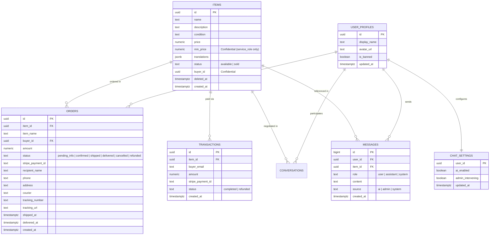

# Data Architecture & Database Models

Nego-Lah uses **PostgreSQL** hosted on **Supabase**, combined with **Redis 7** for transient state (locks, rate limits, session tokens, buffered email notification queues).

---

## 1. Core Data Principles & Security Posture

1. **Client-Read Isolation:**
   - The frontend browser client using the public `anon` key can **only** read the `items` table and public storage objects.
   - All other tables (`orders`, `transactions`, `messages`, `chat_settings`, `user_profiles`, `admin_audit_log`) enforce Row-Level Security (RLS) with zero public policies.
2. **Backend Service-Role Authority:**
   - All data mutations and private table queries must pass through the FastAPI backend via the `service_role` key or direct PostgreSQL connection pool (`asyncpg`).
3. **Database-Level Confidentiality:**
   - Confidential columns like `min_price` (seller's negotiation floor) and `buyer_id` are withheld at the database level via column-scoped `GRANT SELECT` privileges ([SPEC-036](../specs/SPEC-036-confidential-item-fields.md), [ADR-0009](../adr/0009-confidential-columns-enforced-in-postgres.md)). Even if an attacker calls PostgREST directly with the anon key, PostgreSQL refuses to return those columns.
4. **Append-Only Chat History:**
   - Messages are stored as individual append-only rows in `public.messages` rather than rewriting JSON arrays, eliminating race conditions between concurrent AI responses and human seller interventions ([SPEC-043](../specs/SPEC-043-capacity-hardening-under-concurrent-load.md)).

---

## 2. Entity Relationship Overview

---

## 3. Database Tables Breakdown

### `public.items`
Stores product catalog listings.
- **`id`** (`uuid`, PK): Unique item identifier.
- **`name`** (`text`): Item title.
- **`description`** (`text`): Detailed description.
- **`condition`** (`text`): Item physical condition.
- **`price`** (`numeric`): Public listing price (RM).
- **`min_price`** (`numeric`): **Private seller floor price**. The AI negotiation agent will never accept offers below this amount. Withheld from client via column-scoped privileges.
- **`image_path`** (`text`): JSON object mapping image keys to CDN URLs.
- **`translations`** (`jsonb`): Trilingual localized fields (`en`, `ms`, `zh`) populated automatically.
- **`status`** (`text`): `'available'` or `'sold'`.
- **`buyer_id`** (`uuid`): Assigned upon confirmed Stripe checkout.
- **`deleted_at`** (`timestamptz`): Soft-delete watermark. Filtered by row-level security policy `using (deleted_at is null)`.

### `public.messages`
Append-only conversation history for AI bargaining and human seller intervention.
- **`id`** (`bigint generated always as identity`, PK): Monotonically increasing sequence ID.
- **`user_id`** (`uuid`, indexed): Buyer's user ID.
- **`item_id`** (`uuid`, FK to `items.id` ON DELETE SET NULL): Associated product listing.
- **`role`** (`text`): `'user'`, `'assistant'`, or `'system'`.
- **`content`** (`text`): Raw message text.
- **`source`** (`text`): Originator of the turn — `'ai'`, `'admin'`, or `'system'`.
- **`created_at`** (`timestamptz`): UTC message timestamp.

### `public.orders`
Lifecycle tracking of fulfilled purchases.
- **`id`** (`uuid`, PK): Order ID.
- **`item_id`** (`uuid`, FK to `items.id`): Sold product.
- **`buyer_id`** (`uuid`): Customer user ID.
- **`amount`** (`numeric`): Final agreed checkout price.
- **`status`** (`text`): Order state (`'pending_info'`, `'confirmed'`, `'shipped'`, `'delivered'`, `'cancelled'`, `'refunded'`).
- **`stripe_payment_id`** (`text`): Payment intent reference.
- **`recipient_name`**, **`phone`**, **`address`** (`text`): Shipping delivery destination.
- **`courier`**, **`tracking_number`**, **`tracking_url`** (`text`): Carrier information (e.g. J&T Express, Pos Laju) and shipment URL.
- **`shipped_at`**, **`delivered_at`** (`timestamptz`): Order status transition timestamps.

### `public.transactions`
Immutable payment ledger. Preserved even if associated listings or orders are soft-deleted or purged.

### `public.chat_settings`
Real-time state flags for negotiations.
- **`ai_enabled`** (`boolean`): If false, AI stops answering, enabling human takeover.
- **`admin_intervening`** (`boolean`): Seller is actively chatting; UI displays the human intervention badge.

### `public.user_profiles`
Public profile metadata mirroring `auth.users`. Contains display name, custom CDN avatar URL, and platform ban status.

### `public.admin_audit_log`
Records administrative security events (promotions, refunds, bans, item modifications).

---

## 4. Supabase Migrations History

All database changes are tracked in sequential SQL migrations in `supabase/migrations/`:

| Migration File | Purpose |
| :--- | :--- |
| `20260628000000_baseline_schema.sql` | Baseline tables (`items`, `orders`, `transactions`, `conversations`, `chat_settings`, `user_profiles`). |
| `20260628000100_rls_and_storage.sql` | Enables RLS, sets public read on `items`, locks down storage buckets. |
| `20260628000200_admin_redesign.sql` | Replaces legacy admin tables with `admin_audit_log` and role-based app metadata. |
| `20260629000000_item_soft_delete.sql` | Adds `deleted_at` timestamp column to `items`. |
| `20260630000000_payment_idempotency.sql` | Adds unique constraints and idempotency keys to order and transaction creation. |
| `20260701000000_item_translations.sql` | Adds `translations` JSONB column for trilingual content. |
| `20260702000000_items_column_privileges.sql` | Narrows `SELECT` grants for `anon` & `authenticated` to hide `min_price` and `buyer_id`. |
| `20260907000000_append_only_messages.sql` | Introduces the high-concurrency append-only `messages` table and backfills legacy history. |
| `20260909000000_admin_conversation_read_state.sql` | Adds admin durable conversation read watermark tracking. |
| `20260910000000_order_shipment_tracking.sql` | Adds courier, tracking number, tracking URL, and shipment timestamps to `orders`. |
| `20260910100000_buyer_conversation_read_state.sql` | Tracks buyer unread message watermarks. |
| `20260910110000_conversation_archive.sql` | Adds conversation archive status flag. |

---

## 5. Storage Policies

- **Bucket `images`:**
  - **Read:** Public access (`SELECT` granted).
  - **Write:** Restricted to backend service role. Client browser direct upload is blocked.
  - **Pipeline:** Images are uploaded through `POST /items/upload` or `/users/avatar`, processed server-side (`core/images.py` normalizes HEIC, strips EXIF/GPS, resizes, optimizes compression), and stored onto Supabase Storage CDN.
