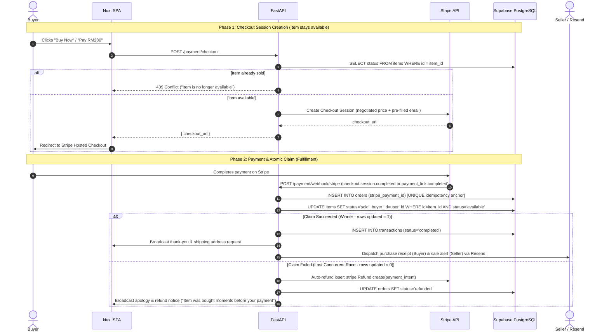

# Core Flows

Sequence diagrams for the journeys that cross the most components. Living document; the
component overview is in [Architecture](../architecture/README.md).

---

## 1. A negotiation turn

```mermaid
sequenceDiagram
    autonumber
    actor Buyer
    participant SPA as Nuxt SPA
    participant API as FastAPI
    participant Redis
    participant Agent as Agent (bot.py)
    participant LLM as Qwen (M5) or Gemini

    Buyer->>SPA: "RM280 can bro?"
    SPA->>API: POST /chat/stream (cookie + X-CSRF-Token)
    API->>API: Persist the buyer message, start a detached turn
    API->>Redis: Probe local model, take lease llm:qwen:busy (NX, 45 s)
    Redis-->>API: Granted → Qwen, held → Gemini
    API->>Agent: Run the turn on the pinned provider
    Agent->>API: evaluate_offer(280)
    API-->>Agent: COUNTER RM300 (floor never returned)
    Agent->>LLM: Phrase the reply
    LLM-->>API: Tokens
    API-->>SPA: SSE chunks
    API->>Redis: Release lease; publish to the buyer's channel
    SPA-->>Buyer: Reply bubble
```

On the local model the agent step is split into a decider and a speaker; see
[agent architecture](../architecture/agent.md#2-running-the-turn-botpy).

---

## 2. Optimistic Claim-at-Payment & Fulfillment Flow (ADR-0001)

Nego-Lah deliberately avoids pessimistic inventory locking to prevent denial-of-inventory attacks and cart hoarding. Items stay available until paid; concurrency is resolved atomically at fulfillment:



---

## 3. Human-in-the-Loop (HITL) Takeover Flow


