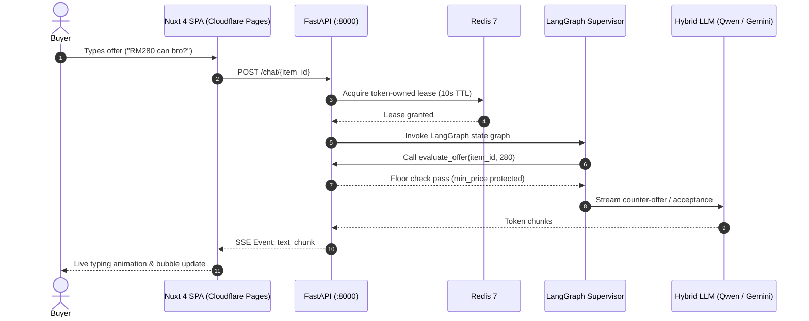
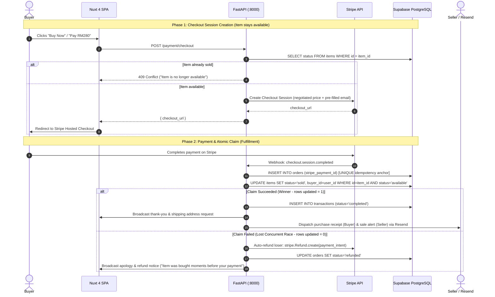
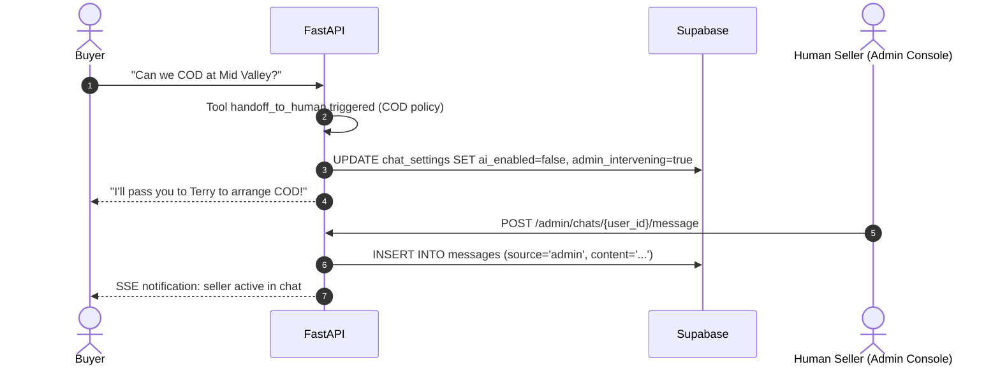

# Core System Flows & State Machines

This directory documents the key end-to-end user journeys and state machine workflows across Nego-Lah.

---

## 1. Real-Time AI Bargaining & Streaming Flow

---

## 2. Optimistic Claim-at-Payment & Fulfillment Flow (ADR-0001)

Nego-Lah deliberately avoids pessimistic inventory locking to prevent denial-of-inventory attacks and cart hoarding. Items stay available until paid; concurrency is resolved atomically at fulfillment:

---

## 3. Human-in-the-Loop (HITL) Takeover Flow

