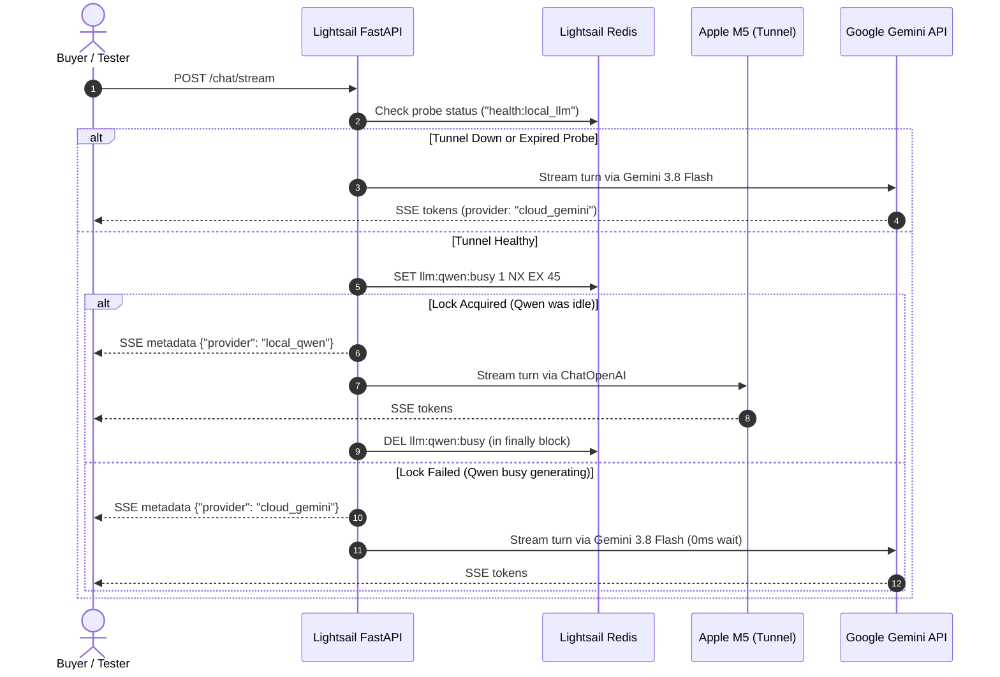

# Context & Objectives
Nego-Lah's production deployment runs the frontend as a Nuxt 4 SPA on **Cloudflare Pages**, the API on **AWS Lightsail** (FastAPI + Redis + Caddy), and leverages a self-hosted `Qwen3.6-35B-A3B-4bit` vision-language model running on an Apple Silicon M5 MacBook Pro (32GB Unified Memory) exposed via a Cloudflare Tunnel (`https://llm.negolah.my`).

For portfolio demonstration and testing (with up to 20 simultaneous users), the Apple M5 laptop can comfortably handle **1 active generation stream** at full speed (~50-70 t/s) with zero thermal or unified memory pressure. Running unbatched parallel streams on Apple Silicon saturates GPU bandwidth and degrades latency to single-digit tokens/second.

This specification designs an **Active Edge/Cloud Load Balancer** in the Lightsail FastAPI backend:
1. When local Qwen is healthy and idle, queries route to the self-hosted Apple Silicon model.
2. If Qwen is currently generating an active turn (detected via an atomic Redis lease), concurrent queries **overflow immediately to Google Gemini (`gemini-3.8-flash`) with 0ms queuing delay**.
3. Once Qwen completes generation, the lease is released and subsequent queries route back to Qwen.
4. If the laptop sleeps or the tunnel is down, all traffic falls back seamlessly to Gemini.
5. The active provider is surfaced via SSE stream metadata so the UI can display live hardware attribution chips.

# Acceptance Criteria
- [x] **Atomic Redis Concurrency Lease:** Implement `try_acquire_local_llm_lease()` and `release_local_llm_lease()` using `SET llm:qwen:busy 1 NX EX 45` and `DEL llm:qwen:busy` via `cache.redis_client`.
- [x] **Instant Zero-Wait Overflow:** If the lease cannot be acquired (Qwen busy) or local probe fails, the dispatcher instantly routes the turn to `gemini-3.8-flash` without user queuing.
- [x] **Removal of Global Singleton Agent Caching:** Refactor module-level singletons (`_model = None`, `_customer_agent = None` in `backend/agent/bot.py` and `backend/agent/sub_agents/item_agent.py`) so the agent dynamically selects the model per invocation turn or uses a dynamic `BaseChatModel` proxy.
- [x] **Resilient Lease Lifecycle:** Lease release is wrapped in a `try...finally` block; the 45-second Redis TTL prevents permanent deadlocks in the event of worker crashes or unhandled client disconnects.
- [x] **Tight Tunnel Connection Timeout:** The HTTP client connecting to `LOCAL_LLM_BASE_URL` uses a strict 2.0s connect/first-byte timeout so downed tunnels fail over instantly without hanging the user.
- [x] **Telemetry & Model Attribution Metadata:** The `/chat/stream` SSE generator yields an initial metadata event specifying `{"provider": "local_qwen" | "cloud_gemini", "model": "..."}`.
- [x] **Frontend Attribution Badge:** Nuxt UI displays a subtle indicator chip on messages showing whether the response was generated by *Self-Hosted Apple M5 (Qwen 35B)* or *Cloud Overflow (Gemini 3.8 Flash)*.

# Technical Design & Contracts

### 1. Hybrid Dispatcher Flow



### 2. Concurrency Lease Contract (Redis)
- **Lock Key:** `llm:qwen:busy`
- **Acquire Command:** `redis_client.set("llm:qwen:busy", "1", nx=True, ex=45)`
- **Release Command:** `redis_client.delete("llm:qwen:busy")`
- **Health Cache Key:** `health:local_llm` (TTL: 30s)

### 3. Dynamic Model Provider Proxy
Instead of reconstructing the entire LangGraph `create_react_agent` on every turn (which incurs compilation overhead), implement a dynamic `DynamicHybridChatModel(BaseChatModel)` or a context-aware factory that dispatches `.astream()` / `.ainvoke()` to the selected provider dynamically for the duration of the request context.

### 4. SSE Stream Metadata Schema
```json
// Emitted before the first token delta in /chat/stream, as an AI SDK v5 data
// part (see Deviation 3 — this stream speaks the UI message protocol).
data: {"type": "data-provider", "id": "provider", "data": {"provider": "local_qwen", "model": "mlx-community/Qwen3.6-35B-A3B-4bit", "hardware": "Apple M5 (Self-Hosted)"}}
```

# Test-Driven Development (TDD) Scenarios
- [x] **Scenario 1 (Idle Local Dispatch):** When `health:local_llm` is `1` and `llm:qwen:busy` does not exist, `get_chat_model()` acquires the Redis lock and returns the local `ChatOpenAI` instance.
- [x] **Scenario 2 (Busy Cloud Overflow):** When `llm:qwen:busy` already exists in Redis, `get_chat_model()` immediately returns `ChatGoogleGenerativeAI` without attempting HTTP connections to the tunnel.
- [x] **Scenario 3 (Lease Release on Completion):** After stream generator finishes (or raises an exception), `llm:qwen:busy` is deleted from Redis, allowing the subsequent query to route to Qwen.
- [x] **Scenario 4 (Multi-Worker Concurrency):** Simulate 4 concurrent requests across separate processes; assert exactly 1 request acquires the local Qwen lease and 3 requests immediately overflow to Gemini.
- [x] **Scenario 5 (Session Persona Continuity):** Verify conversation history loaded from Redis/Supabase is forwarded identically whether the turn is handled by Qwen or Gemini.
- [x] **Scenario 6 (Deadlock Prevention):** Verify that if a process holding the lease dies abruptly without calling `DEL`, the Redis key expires after 45 seconds.

# Implementation Decisions & Deviations

These were settled against the real codebase; they depart from the literal text above.

1. **Provider is pinned per request, not per LLM call.** `hybrid_llm_session()` resolves
   the provider once and stores it in a `ContextVar` (`current_provider`). The supervisor
   and both sub-agents (`item_agent`, `stripe_agent`) run inside that one turn, so they all
   share a single provider and a single lease. Without pinning, a supervisor holding the
   lease would push its own sub-agents to Gemini mid-turn and split one conversation across
   two models (breaks Scenario 5).

2. **Dynamic model via LangGraph's callable-model support, not a `BaseChatModel` subclass.**
   langgraph 1.2.11's `create_react_agent` accepts `Callable[[state, runtime], BaseChatModel]`.
   The graph is still compiled once (§3's requirement) while the model is resolved per turn.
   The callable must bind tools itself, and is deliberately *sync* — it never probes when the
   ContextVar is pinned, so it cannot block the event loop.

3. **SSE attribution is an AI SDK data part, not a raw `event: metadata` frame.**
   `/chat/stream` speaks the Vercel AI SDK v5 UI message stream (`x-vercel-ai-ui-message-stream: v1`),
   where every frame is `data: {"type": ...}`. A bare `event: metadata` frame would be dropped by
   the client parser. The equivalent in-protocol carrier is a custom data part:
   `{"type": "data-provider", "id": "provider", "data": {provider, model, hardware}}`.

4. **`connect=2.0s`, read timeout generous.** A 2.0s *read* timeout would kill legitimate
   long prefill (35B model, long persona prompt, plus item images). A downed tunnel or a
   sleeping laptop is a *connect* failure, which the 2.0s connect timeout plus the cached
   health probe already cover instantly. Read timeout is `LOCAL_LLM_READ_TIMEOUT` (default 120s).

5. **Frontend badge lives in `frontend/app/pages/chat.vue`.** There is no
   `components/chat/MessageBubble.vue` — bubbles are rendered inline through `UChatMessages`'s
   `#content` slot. The badge renders from the live `data-provider` part, so it appears on
   messages streamed in this session; history replayed from Supabase carries no provider column
   and therefore shows no badge.

# Implementation Files
- `backend/agent/llm_factory.py` - Atomic Redis lease, per-request provider pinning, connection timeouts.
- `backend/agent/bot.py` - Dynamic per-turn model routing; module-level model singleton removed.
- `backend/agent/sub_agents/item_agent.py`, `stripe_agent.py` - Dynamic model binding for sub-agent graphs.
- `backend/routes/chat.py` - `data-provider` attribution part on the SSE stream.
- `frontend/app/pages/chat.vue` - Live badge displaying M5 Local vs Gemini Cloud.
- `backend/tests/test_hybrid_llm_load_balancer.py` - TDD suite for lease lifecycle, overflow, and multi-worker concurrency.

# Verification
- `backend/tests/test_hybrid_llm_load_balancer.py` — 24 tests covering all six scenarios
  (lease atomicity, zero-wait overflow, release on success/exception, 4-way concurrency,
  history parity across providers, TTL deadlock expiry) plus the connect-timeout and
  no-frozen-singleton guarantees.
- Full backend suite: 989 passing. Frontend: 708 passing across 51 files.
- Integration checked against a stub reproducing `local-llm`'s exact
  `/v1/chat/completions` wire format (same schemas and chunk order as
  `src/local_llm/api/v1/endpoints/openai.py`): the health probe reads `/v1/models`,
  token streaming assembles correctly, `reasoning_content` does not leak into the
  reply, and **tool calls round-trip into LangChain `tool_calls` with deserialized
  args** — the part the supervisor agent depends on.

# Operational Notes
- `local-llm`'s own `settings.PORT` defaults to **8000**, which collides with this
  backend. Run it as `uv run main.py --port 8001` locally, or point
  `LOCAL_LLM_BASE_URL` at the Cloudflare Tunnel.
- The test suite pins `LLM_PROVIDER=gemini` in `conftest.py`. With `auto` the health
  probe fires a real request at `LOCAL_LLM_BASE_URL`, so on a machine actually running
  the MLX server the suite would silently generate from the real 35B model.
